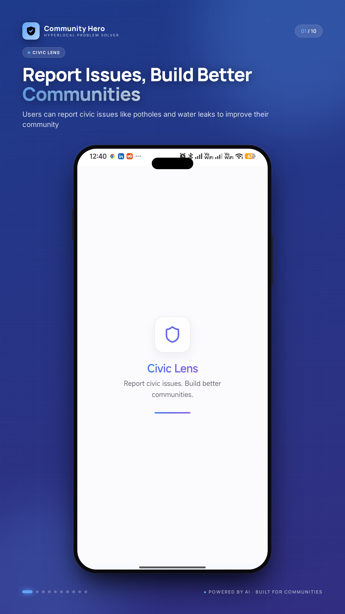
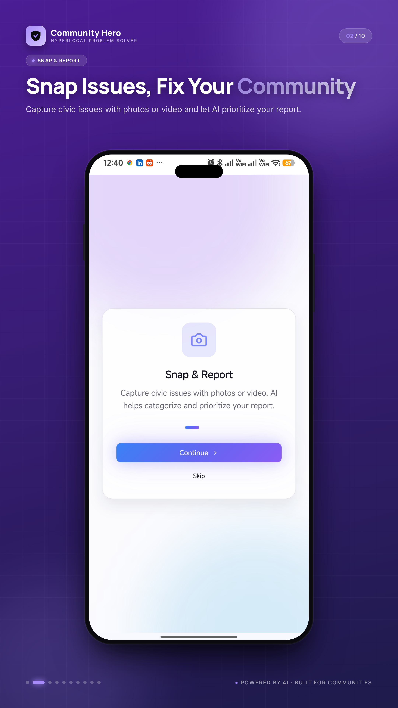
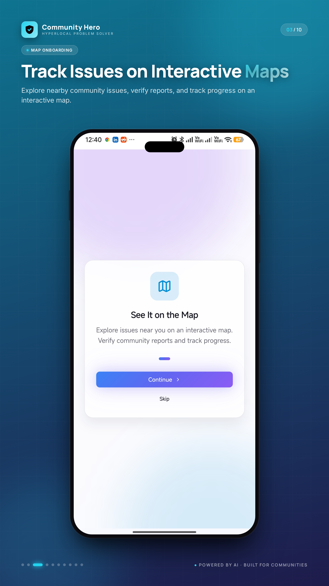
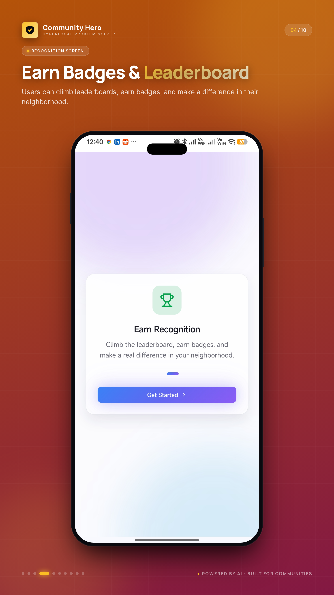
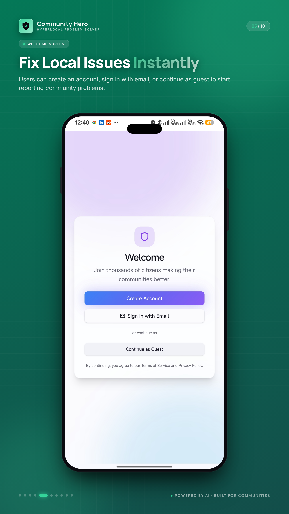
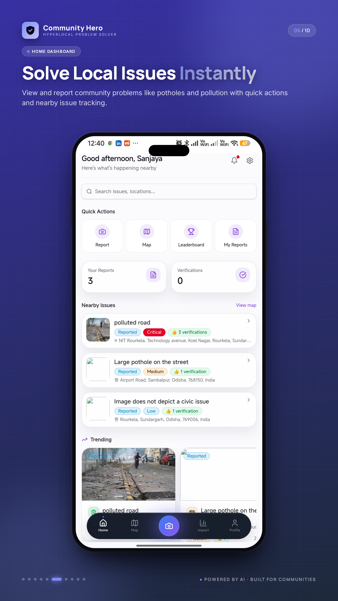
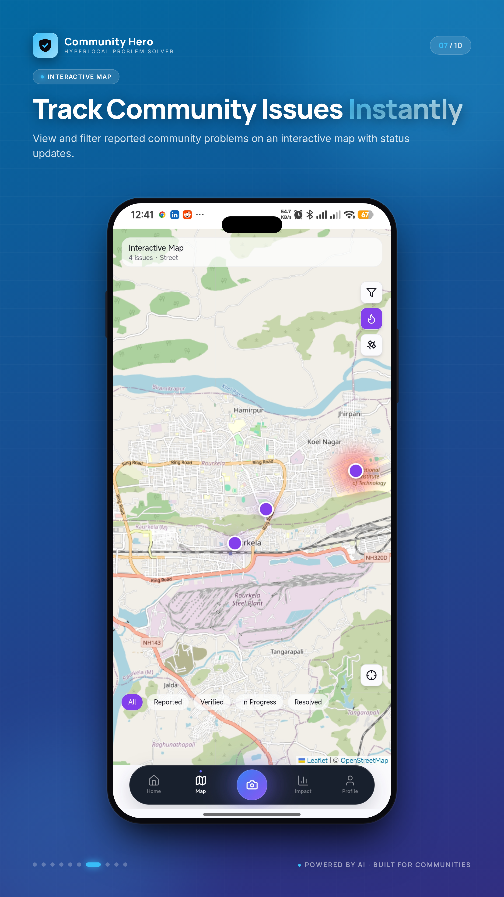
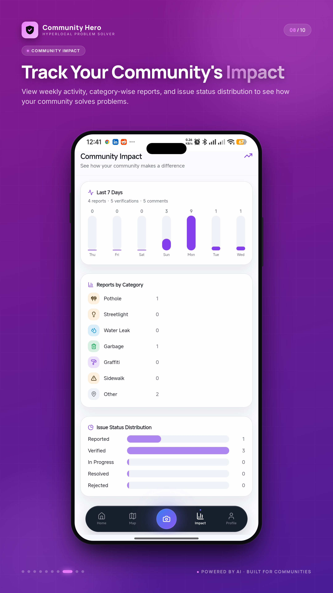
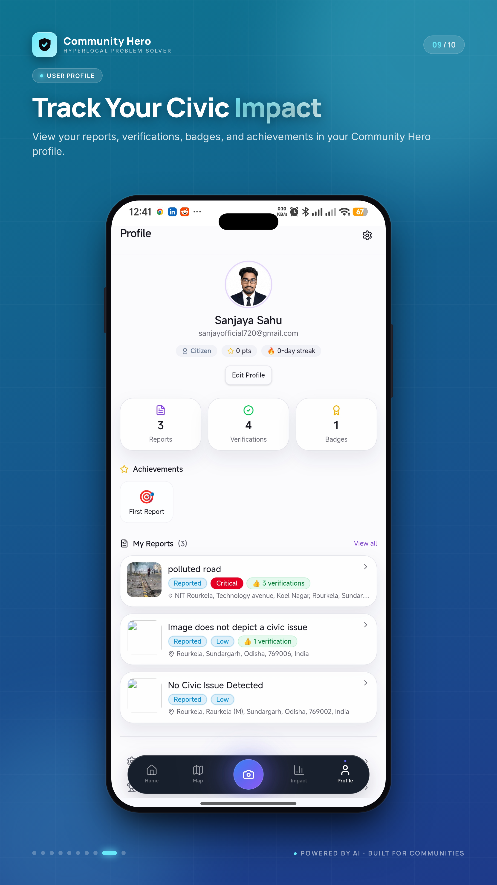
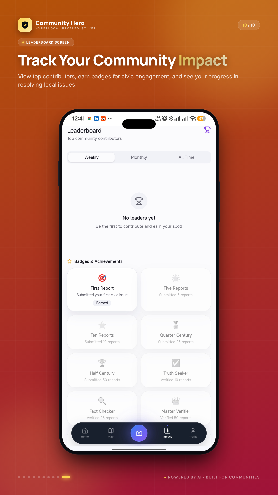

# CivicLens AI

<div align="center">
  
  <h3>AI-Powered Civic Issue Reporting & Management Platform</h3>
  <p>Empowering citizens and local governments to collaborate on urban improvements through artificial intelligence and real-time data.</p>
</div>

---

## 💡 About CivicLens AI

**CivicLens AI** is an innovative, AI-powered civic tech platform that empowers citizens and local governments to collaboratively address urban challenges. It streamlines the process of reporting, verifying, and resolving community issues such as potholes, broken streetlights, and graffiti. By leveraging advanced artificial intelligence, CivicLens AI enhances transparency, fosters active citizen engagement, and provides government officials with efficient tools for issue management and resolution. Citizens can easily report problems with a photo, which our integrated AI analyzes to automatically categorize, assess severity, and suggest actionable descriptions. This ensures that urban infrastructure problems are promptly identified, prioritized, and resolved, improving urban environments for everyone.

## ✨ Features

- **Intuitive Issue Reporting:** A 6-step reporting wizard with geolocation and image upload.
- **Community Voting & Verification:** Democratic upvote/downvote system with reputation adjustments.
- **Interactive Map:** Real-time leaflet map with marker clustering and status filtering.
- **Leaderboard & Gamification:** Weekly, monthly, and all-time leaderboards rewarding active citizens with badges.
- **Government Dashboard:** Advanced triage queue, analytical charts, and status management for officials.
- **Real-Time Notifications:** Live updates on issue statuses, new comments, and earned badges.

## 🤖 AI Capabilities

CivicLens leverages **Google Gemini 1.5 Flash** for high-speed, accurate image and text analysis:
- **Auto-Categorization:** Determines if an issue is a pothole, electrical hazard, vandalism, etc.
- **Severity Assessment:** Evaluates the danger level (Low, Medium, High, Critical).
- **Smart Suggestions:** Auto-generates concise titles, descriptions, and searchable tags based on visual evidence.
- **Duplicate Detection:** Intelligent fallback to prevent multiple reports of the same incident in close proximity.

## 📸 App Screenshots

### Mobile Experience
| Splash Screen | Snap & Report | Map Onboarding | Recognition | Welcome |
|:---:|:---:|:---:|:---:|:---:|
|  |  |  |  |  |

### Features & Dashboards
| Home Dashboard | Interactive Map | Community Impact | User Profile | Leaderboard |
|:---:|:---:|:---:|:---:|:---:|
|  |  |  |  |  |

## 🛠 Technology Stack

**Frontend:**
- React 19 (Vite 8)
- Tailwind CSS 4 + Radix UI
- TanStack Query (React Query)
- Framer Motion
- Leaflet Maps

**Backend & Infrastructure:**
- Firebase Cloud Functions v2 (Node.js)
- Firebase Firestore (NoSQL Database)
- Firebase Authentication & Storage
- Google Gemini API
- Turborepo (Monorepo Architecture)

## 🏗 Architecture Overview

The project is structured as a feature-based monorepo managed by Turborepo:
```
Firebase (Firestore + Auth + Storage + Cloud Functions + Hosting)
     │
     └── Web App (React 19 SPA)
              │
              └── Shared Layer (@CivicLens/shared — Zod Schemas + Types)
```
- **Schema-First Design:** Zod schemas in the shared package act as the single source of truth.
- **Robust Security:** Granular Firestore and Storage security rules based on role-based access control (RBAC).

## 🚀 Installation & Setup

### Prerequisites
- [Node.js](https://nodejs.org/) >= 20
- npm >= 10
- [Firebase CLI](https://firebase.google.com/docs/cli): `npm install -g firebase-tools`

### 1. Clone the Repository
```bash
git clone https://github.com/sanjayasahu/civiclens-ai.git
cd civiclens-ai
```

### 2. Install Dependencies
```bash
npm install
```

### 3. Environment Variables

Copy `.env.example` to `.env.local` in the root:
```bash
cp .env.example .env.local
```
Fill in your Firebase project configuration and Gemini API Key:
```env
VITE_FIREBASE_API_KEY="your_api_key"
VITE_FIREBASE_AUTH_DOMAIN="your_project_id.firebaseapp.com"
VITE_FIREBASE_PROJECT_ID="your_project_id"
VITE_FIREBASE_STORAGE_BUCKET="your_project_id.firebasestorage.app"
VITE_FIREBASE_MESSAGING_SENDER_ID="your_sender_id"
VITE_FIREBASE_APP_ID="your_app_id"
VITE_GEMINI_API_KEY="your_gemini_api_key"
```

For the Cloud Functions environment, set the secrets using the Firebase CLI:
```bash
firebase functions:config:set gemini.api_key="your_gemini_api_key"
```

## 💻 Running Locally

To start the development server across all packages:
```bash
npm run dev
```
The web application will be available at `http://localhost:5173`.

## ☁️ Deployment

Build the project for production:
```bash
npm run build
```

Deploy to Firebase (Hosting, Functions, Firestore Rules, and Storage Rules):
```bash
firebase deploy
```

## 🗺 Future Roadmap

- **Offline Mode:** Implement full offline reporting capabilities using service workers.
- **Predictive Analytics:** Use historical data to predict infrastructure failures before they happen.
- **Multi-Language Support:** Expand accessibility for diverse urban populations.

## 👥 Team Information

- **Sanjaya Sahu** - Principal DevOps Engineer & Senior Software Engineer

## 📄 License

This project is licensed under the MIT License. See the [LICENSE](LICENSE) file for details.
